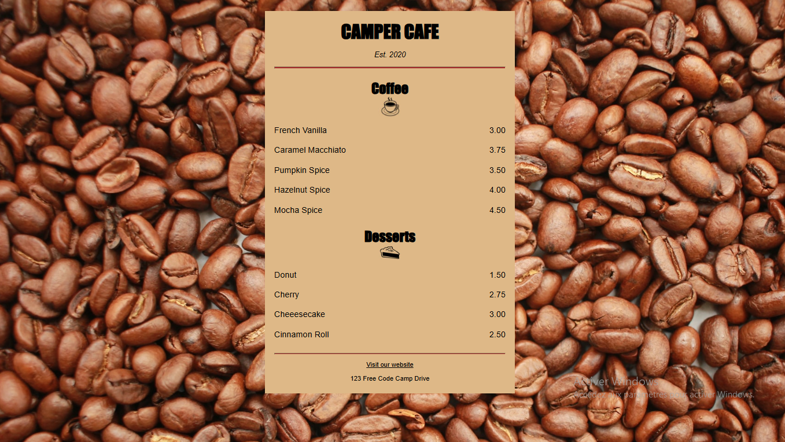

# Café Menu — Projet HTML & CSS

Ce projet a été réalisé dans le cadre de mon apprentissage du **HTML** et du **CSS**.  
L’objectif était de créer une **page de menu de café** en appliquant les bases du style CSS pour concevoir une mise en page simple, propre et harmonieuse.

---

## Description du projet

Le **Café Menu** est une page web statique présentant le menu d’un café fictif.  
Le but de ce projet est de mettre en pratique les notions fondamentales du HTML et du CSS, notamment :  
- la structuration du contenu avec des **balises sémantiques** ;
- la **mise en forme** du texte, des images et des sections avec CSS ;
- l’utilisation de **propriétés de mise en page** telles que `display`, `margin`, `padding`, `text-align`etc.

Ce projet constitue une première étape vers la maîtrise de la conception d’interfaces web modernes et responsives.

---

## Objectifs du projet

- Découvrir le **rôle du CSS** dans la mise en forme d’une page web.
- Comprendre **l’anatomie d’une règle CSS** (sélecteur, propriété, valeur).  
- Différencier les **trois méthodes d’intégration du CSS** : inline, interne et externe.
- Relier une **feuille de style externe** à un document HTML. 
- Manipuler les **propriétés de base** : 
  - couleurs (`color`, `background-color`)  
  - marges (`margin`)  
  - espacements internes (`padding`)  
  - tailles (`width`, `height`, `font-size`)  
  - alignements et polices (`text-align`, `font-family`)  
- Utiliser la propriété `display` pour aligner des éléments sur une même ligne (`block`, `inline`, `inline-block`). 
- Comprendre la différence entre les éléments inline et inline-block. 
- Structurer le contenu d’une page web à l’aide de **balises sémantiques** (`section`, `article`, `footer`, `address`...).
- Adapter la mise en page aux écrans grâce à la balise `<meta name="viewport">`

---

## Aperçu du résultat

Voici un aperçu du rendu final de la page :



Vous pouvez également **voir le résultat en ligne sur CodePen** :
[https://codepen.io/idriss-enone/full/jEWYbGe](https://codepen.io/idriss-enone/full/jEWYbGe)

---

## Compétences acquises

- Structure sémantique d’une page HTML.  
- Sélecteurs CSS et hiérarchie des styles.  
- Mise en forme du texte et des images.  
- Utilisation des propriétés `display`, `margin`, `padding`, `text-align`, `background-image`... 
- Création d’une page web responsive de base (grâce à `width`, `max-width` et `margin auto`).

---

## Technologies utilisées

| Technologie | Description |
|--------------|-------------|
| **HTML5** | Structure et contenu de la page |
| **CSS3** | Mise en forme et design visuel |
| **VS Code** | Éditeur de code utilisé |

---

##  Lancer le projet

1. **Cloner le dépôt GitHub :**
   ```bash
   git clone https://github.com/idriss-enone/cafe-menu.git 

2. Ouvrir le projet :

  - Ouvrir le dossier dans VS Code.
  - Lancer le fichier index.html dans votre navigateur.